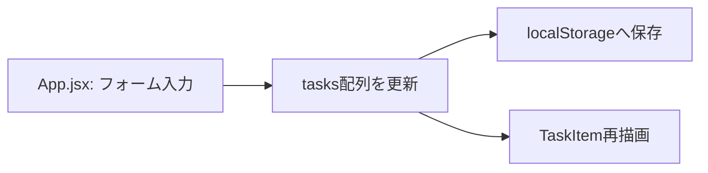
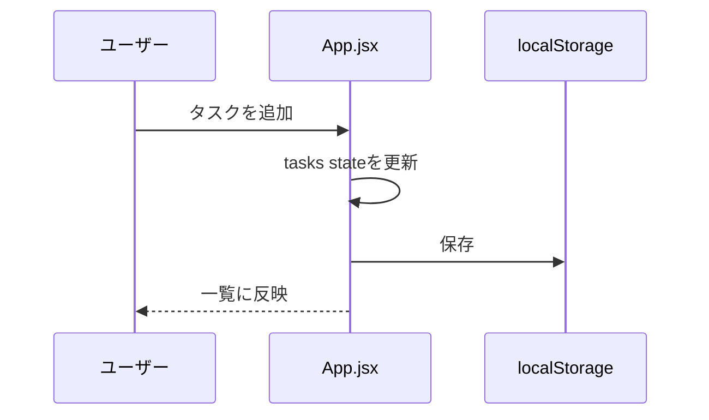

# コミット〜PR作成

このスキルは、作業中の変更を安全にコミットし、レビューしやすいPull Requestに仕上げるまでの手順をまとめたものです。「動くところまでできたのでコミットしておいて」のような曖昧な依頼でも、このスキルの手順に沿って進めてください。

## なぜこの手順が必要か

このリポジトリでは、コミット規約やPRの型が`CLAUDE.md`と`.github/pull_request_template.md`にすでに定義されています。人間のレビュアーは「これはどのチケット由来か」「何をやって何をやっていないか」「どう確認したか」を毎回同じ場所で読みたいので、その形式を外すとレビューコストが上がります。またクレデンシャルの誤コミットは一度pushすると履歴に残り続けるため、コミット前に機械的なチェックを挟む価値があります。

## 手順

### 1. 変更内容を確認する

```
git status
git diff
```

意図しないファイル（ビルド成果物、`.env`、個人的なメモなど）が混ざっていないかをここで確認してください。追跡していないファイルの扱いに迷ったら、勝手に消したり無視したりせず、ユーザーに確認してください。

### 2. コミット対象をステージし、クレデンシャル混入をチェックする

対象ファイルを`git add`した後、必ず同梱スクリプトでチェックを行ってください。

```
bash .claude/skills/commit-and-pr/scripts/check_secrets.sh
```

- 終了コード`0`（検出なし）でも、パターンに含まれない形のシークレット（例: 変数に直接ハードコードされた社内API URLなど）を見逃すことはあり得るので、`git diff --cached`をざっと目視することも省略しないでください。
- 終了コード`1`（何か検出）の場合は、**そのままコミットを進めないこと**。検出箇所を提示し、誤検知でないか・本当に機微情報かをユーザーに確認してから次に進んでください。誤検知だった場合のみ、その旨を説明した上で続行します。
- `.env`ファイルなど、そもそもコミットに含めるべきでないファイルが検出された場合は、`git restore --staged <file>`で外すことを提案してください。

### 3. コミットする

コミットメッセージは`CLAUDE.md`の規約に従います（このリポジトリ固有のルールなので、他のリポジトリに同じ規約を持ち込まないこと）。

- 件名は簡潔な英語の命令形（例: `Add due date badge coloring`）
- Conventional Commits形式（`feat:`, `fix:`など）のプレフィックスは付けない
- 本文が必要な場合は、件名の後に空行を挟んで「何を」ではなく「なぜ」を書く

セッションの指示でCo-Authored-ByやClaude-Sessionなどのフッターを付ける運用になっている場合は、それに従ってください。

### 4. リモートにpushする

```
git push -u origin <ブランチ名>
```

### 5. Pull Requestを作成する

まず、そのブランチに対応するPRがすでに存在しないか確認してください（GitHub MCPツールが使える場合は`mcp__github__list_pull_requests`や`mcp__github__pull_request_read`、UI経由で先にPRが作られているケースもあります）。

- **既存PRがある場合**: 新規作成せず、pushした時点でPRは自動的に更新されます。必要なら`mcp__github__update_pull_request`で説明文を更新してください。
- **既存PRがない場合**: GitHub MCPツール（`mcp__github__create_pull_request`など）が利用できるならそれで作成します。利用できない・失敗する環境では、`git push`まで行った上で、PR作成用のURL（pushの出力に含まれる`https://github.com/<owner>/<repo>/pull/new/<branch>`）をユーザーに伝え、作成を促してください。

PRのdraft/readyの状態や、レビュアーのアサインなど明示的な指示がない項目については、ユーザーに確認するかデフォルト（ready、アサインなし）で進めてください。

### 5.1. UIに影響する変更がある場合はスクリーンショットをPR本文に埋め込む

UIの見た目・挙動に影響する変更（表示の追加・変更、レイアウト、操作フローの変更など）を含むPRでは、画面のスクリーンショットをPR本文に埋め込むことを必須とします（ADR 0003・0006）。手順は次のとおりです。

1. 変更した画面に対応する`docs/screens/<画面名>.png`を、`verify-front`スキルで撮影した最新のスクリーンショットで上書きする（`design-docs`ルール参照）。新しい画面を追加した場合は`docs/screens/<画面名>.md`と`docs/screens/README.md`の一覧も追加する。
2. これを通常のコミットに含めてpushする。
3. PR本文の「テスト内容」セクションに、Markdown画像記法（例: ``）で`docs/screens/`の画像を埋め込む。新規にPRを作成する場合と、既存PRの本文を`mcp__github__update_pull_request`で更新する場合のどちらでもよい。

相対パスの画像はリポジトリのデフォルトブランチを基準に解決されるため、マージ前のPR本文プレビューでは表示されないことがある（マージ後は表示される）。`docs/screens/`は画面変更のたびに上書きする「現在の仕様」なので、過去にマージ済みのPRの本文に埋め込まれた画像も、その後の変更で見た目が変わりうる（詳細はADR 0006）。UIに影響しない変更（ロジックのみの修正など）ではこの手順は不要。

## PR説明文の書き方

PRの説明文は**日本語**で書き、`.github/pull_request_template.md`の見出し構成にそのまま従ってください。テンプレートを無視して独自フォーマットで書かないこと。

```markdown
## 起票の元になったチケットまたは投稿

## 対応内容

## 対応していないもの

## テスト内容
```

各セクションの書き方:

- **起票の元になったチケットまたは投稿**: 会話やIssue、Slackスレッドなど、対応の発端になったものを書く。特にチケットがなく会話内の指示だけの場合は、その依頼内容を一言で要約する。
- **対応内容**: 何をどう変えたかを書く。変更が単一ファイル・単一目的のシンプルなものなら文章だけで十分。**複数ファイルにまたがる変更、処理フローの変更、コンポーネント間のやり取りが絡む変更**の場合は、Mermaid記法の図を添えて構造や流れを可視化する（下記参照）。図のための図は不要で、文章だけで十分伝わる変更に無理やり図を付けないこと。
- **対応していないもの**: 依頼内容のうち今回のPRではスコープ外にしたもの、意図的に見送った対応を書く。特になければ「なし」と書く。存在するのに省略するとレビュアーが誤解するので注意する。
- **テスト内容**: 実際に何を確認したかを具体的に書く（例: `npm run build`が通ることを確認、ブラウザで実際に操作して期待通りの表示になることを確認、など）。このリポジトリには自動テストがないため、「テストを実行しました」のような曖昧な記述ではなく、手動確認の手順を書く。実際に確認していない内容を書かないこと。**UIに影響する変更がある場合は、上記5.1の手順でスクリーンショットをこのセクションに埋め込むことを必須とする**（テキストでの説明だけで済ませない）。

### Mermaidを使う目安と例

ファイル間の呼び出し関係やデータの流れを示すなら`flowchart`、時系列のやり取り（イベント発火→状態更新→再描画など）を示すなら`sequenceDiagram`が向いています。





図は「実際にこのPRで変わった構造・フロー」だけを描き、変更していない部分まで詳細に描き込まないでください。
