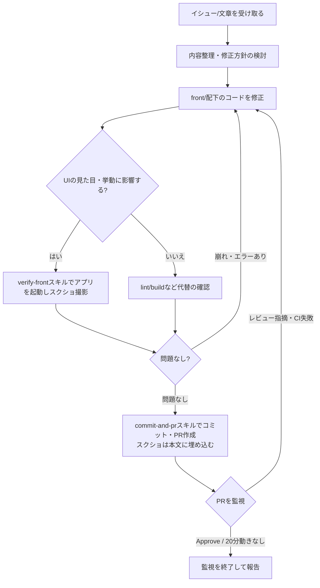

# イシューから動作確認・PR作成までの一連の流れ

「イシューや文章で修正内容を伝えたら、直してもらって、動作確認のスクショ付きでコミット・PRまで一気通貫でお願いしたい」という依頼に応えるためのワークフローです。途中でユーザーの確認は挟まず、動作確認の結果（スクショ）はPR本文に残してPR上でレビューしてもらいます。

## なぜ動作確認を挟むのか

このリポジトリ（`front/`）はテストランナーが整備されていません（`CLAUDE.md`参照）。つまりコードの正しさを保証する自動テストが存在しないため、UIに関わる変更は人間の目で見た確認が唯一の品質担保になります。動作確認をせずにPRを出すと、見た目が崩れていたり意図と違う挙動になっていたりしても誰も気づけません。だからこそ「修正→動作確認（スクショ）→コミット・PR（スクショを本文に埋め込む）」の順序を飛ばさず、人の目での確認はPRのレビュー時に行えるようにします。

## 全体の流れ

### 1. イシュー・依頼内容を整理する

ユーザーから渡されたイシューの文章、Slackスレッドの引用、口頭の依頼などを読み、次を明確にしてから着手します。

- 何が問題/要望なのか（現状の挙動 → 期待する挙動）
- 対応範囲はどこまでか（関連しそうだが今回は触らない部分があれば明示的に切り分ける）
- 修正対象は`front/`配下のどのファイルになりそうか（`App.jsx`が状態とロジック、`lib/tasks.js`がデータ層、`components/TaskItem.jsx`が表示専用、という役割分担は`CLAUDE.md`参照）

イシューに`issue-create`スキルで書かれた「実装計画」セクション（修正概要・TODO・完了条件）がある場合は、それを出発点にしてください。方針検討をやり直す必要はなく、TODOを上から順にこなし、完了条件を動作確認（ステップ3）の基準にします。ただし起票後にコードが変わっていて計画どおりに進められない箇所があれば、その差分と調整内容をユーザーに伝えてから進めてください。

**入力が既存PRのレビューコメントの場合**（`pr-review`スキルが投稿した指摘や、人間のレビュアーのコメント）は、`mcp__github__pull_request_read`でPRのレビューとインラインコメントを取得し、未対応のもの（自分の返信がまだ付いていないもの）を対応対象にします。must/imo/nitsのいずれも原則として修正対象とし（ユーザーが「nitsは無視していい」等を指定した場合はそれに従う）、直さないと判断したものはその理由を控えておきます。作業は必ずそのPRのheadブランチ上で行ってください。

内容が曖昧で複数の解釈がありうる場合は、着手前にユーザーに確認してください。憶測で実装を進めて後から手戻りになる方がコストが高くなります。

### 2. コードを修正する

`CLAUDE.md`の規約（コンポーネントは関数宣言＋hooks、スタイリングは`style.css`の既存CSS変数を拡張、UI文言は日本語・識別子とコードは英語、など）に従って修正します。ここではまだコミットしません。

### 3. 動作確認する

**UIの見た目や挙動に影響する変更**（表示の追加・変更、色分け、レイアウト、操作フローの変更など）の場合は、`verify-front`スキルを使って実際にアプリを起動し、修正後の画面のスクリーンショットを撮影し、自分で内容を確認してください（完了条件を満たしているか、崩れ・consoleエラーがないか）。問題があればステップ2に戻って直します。`verify-front`スキルはPlaywrightでのスクリーンショット撮影とconsoleのerror/warning採取、devサーバーの確実な停止までを面倒見てくれるので、`npm run dev`を素朴に叩くよりこちらを使ってください。可能なら以下も一緒に確認し、PR本文に残すと手戻りが減ります。

- 修正前後の比較（該当する画面の変更前・変更後のスクショ、または変更点の指摘）
- 該当機能を実際に操作した結果（例: タスク追加→期限に応じた色分けが反映されるか）
- コンソールエラーが出ていないか

**ロジックのみでUIに影響がない変更**（内部処理の整理、`lib/tasks.js`のバリデーション修正など見た目に現れない変更）の場合は、スクショの撮影を省略してよいですが、その旨と「なぜUIへの影響がないと判断したか」「代わりにどう確認したか（`npm run build`が通ることの確認など）」をPR本文の「テスト内容」に書いてください。省略の判断自体を勝手に広げすぎないよう注意してください（少しでも表示に関わる可能性があれば撮影する側に倒す）。

ここで撮影したスクリーンショットのファイルは、この時点では削除しないでください。UIに影響する変更の場合、ステップ4で`commit-and-pr`スキルの手順に従いPR本文へ埋め込むため、後で再利用します。

### 4. commit-and-prスキルでコミット・PR作成する

`front/`配下を修正した場合は、コミット前に`npm run lint`を実行して壊れていないことを確認してください。

動作確認で問題がなければ、ユーザーの確認を待たずにそのままコミット・PR作成のロジックをここで重複実装せず、`commit-and-pr`スキルを呼び出してください。クレデンシャルチェック、コミットメッセージ規約（英語の命令形、Conventional Commitsプレフィックスなし）、PR説明文のテンプレート準拠（日本語、`.github/pull_request_template.md`の見出し構成、必要に応じてMermaid図）は`commit-and-pr`スキル側の手順に従うため、ここでは触れません。

PRの「起票の元になったチケットまたは投稿」セクションには、ステップ1で整理した元イシュー・依頼内容を、「テスト内容」セクションには、ステップ3で実際に行った動作確認の内容（スクショで確認した操作、または省略した場合はその代わりに確認した内容）を具体的に反映してください。UIに影響する変更でスクショを撮影した場合は、`commit-and-pr`スキルの「5.1. UIに影響する変更がある場合はスクリーンショットをPR本文に埋め込む」の手順で、テキストの説明だけでなく画像そのものをPR本文に埋め込んでください（必須）。

#### 入力がレビューコメントだった場合

新規PRは作らず、`commit-and-pr`の手順で同じブランチにコミット・pushするだけで既存PRが更新されます。pushが完了したら、対応対象にした各インラインコメントに`mcp__github__add_reply_to_pull_request_comment`で返信し、何を対応したか（対応しなかった場合はその理由）を一言で書いてください。スレッドのresolveは行いません（resolveは人間のレビュアーが行うものとして扱います）。再レビューはこのスキルの範囲外です（`pr-review`スキルが担当します。監視中の`pr-review`はこのpushと返信を検知して自動で再レビューします）。

### 5. PR作成後、レビューとCIを監視して対応する

PRを作成（または既存PRへpush）したら、ここで終わらずにPRを監視し、レビュー指摘に対応し続けます。

1. `subscribe_pr_activity`で対象PRを購読し、`send_later`で20分後のチェックインを予約する。
2. イベントが届いたら内容を確認する。
   - **新しいレビュー指摘**（`pr-review`や人間のレビュアーによるRequest changes・インラインコメント） → 「入力がレビューコメントだった場合」の手順で修正・動作確認・push・返信を行う。
   - **CIの失敗** → レビュー指摘とは別件として、ログ（`get_job_logs`など）から原因を特定して修正・pushする。テストのスキップや無効化で通すことはしない。
   - 自分のpush・返信の反響イベントなど、対応不要なもの → 無視する（動きとして数えない）。
   - 対応してpushするたびに、予約済みのチェックインを`delete_trigger`で取り消し、改めて20分後に予約し直す（最後の動きから20分を数えるため）。
3. PRがApproveされた、またはマージ・クローズされたら、`unsubscribe_pr_activity`で購読を解除し、チェックインを取り消して終了する。
4. チェックインが発火した時点で、最後の動き（レビュー・コメント・自分のpush）から20分以上経っていれば監視を中止する。購読を解除し、「20分間レビューに動きがなかったため監視を中止しました」と、未対応の指摘やCIの状態を添えて報告する。ただしCIが赤のままなら、中止前にその修正を済ませる。

監視中はBashの`sleep`やポーリングで待たないこと（イベントとチェックインで起こされるのを待つ）。`subscribe_pr_activity`・`send_later`が使えない環境では監視を行わず、「レビュー後にもう一度`fix-and-verify`（レビュー指摘を直して）を呼んでください」と案内して終了する。
