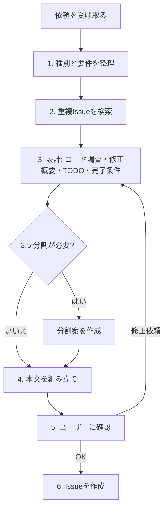

# GitHub Issueの起票（設計つき）

ユーザーからの不具合報告・機能要望の文章を、リポジトリのIssueテンプレートに沿った形に整え、さらにコードを調査して**実装計画（修正概要・TODOリスト・完了条件）**まで書き込んだ上でGitHub上に起票するスキルです。

## なぜ設計まで行うのか

このリポジトリでは、Issueを読んだAI（`fix-and-verify`スキルなど）が実装を担当する運用を想定しています。Issueに「何が問題か」しか書かれていないと、実装側のセッションがコード調査・方針検討をゼロからやり直すことになり、その過程で起票時にユーザーと合意した意図からずれるリスクもあります。起票時点で「どのファイルをどう変えるか」「どこまでやれば完了か」を決めてユーザーの了承を得ておけば、実装側は迷わず着手でき、方針の手戻りも起票時の確認1回で済みます。

一方で、実装の中身（具体的なコード差分）までIssueに書くと、実装時点のコードとずれて誤誘導になりやすいので、**書くのは「方針」と「作業単位」まで**に留めます（詳細は手順3を参照）。

## 前提

- テンプレートは `.github/ISSUE_TEMPLATE/bug_report.md`（バグ報告、`bug`ラベル）と `.github/ISSUE_TEMPLATE/feature_request.md`（機能要望、`enhancement`ラベル）の2種類。
- テンプレートは人間がGitHub UIから起票する場合にも使われるため、テンプレートファイル自体には設計の見出しを足さない。設計内容はこのスキルがテンプレートの見出しの**後ろに追記する**「実装計画」セクションとして書く（手順4）。
- Issueの作成はリポジトリの外部（GitHub上）に見える操作なので、内容が固まる前に見切り発車で作成しないこと。

## 全体の流れ



## 手順

### 1. 種別と要件を整理する

ユーザーの依頼が「バグ報告」「機能要望」のどちらに近いか判断します（迷う場合はユーザーに確認する）。その上で、対応するテンプレートの各見出しを埋められるだけの情報が揃っているかを確認します。

- 情報が不足している場合（再現手順が書かれていない、提案内容が曖昧、など）は、憶測で埋めずにユーザーに確認するか、その項目は「不明」「なし」など正直な記載にする。
- 要件の解釈が複数ありえて、どちらを選ぶかで設計が変わる場合は、手順3に進む前にユーザーに確認する（設計を2通り書いて実装側に選ばせることはしない）。

### 2. 重複しそうな既存Issueがないか確認する

設計に時間をかける前に、類似Issueを検索して重複起票を避けます。

- `mcp__github__search_issues`（自然言語検索）または `mcp__github__list_issues` を使い、同じ内容のIssueがオープン/クローズ問わず既に存在しないか確認する。
- 明らかに重複するIssueが見つかった場合は、新規作成せずそのIssueの内容をユーザーに提示し、コメント追記などの代替手段を提案する。
- 似ているが完全に同一ではない場合は、その旨を一言添えた上で新規起票してよい（関連Issueとして本文の「補足」に記載する）。

### 3. 設計する

実際にコードを読んで、実装計画を組み立てます。**推測でファイル名や関数名を書かないこと**。必ず`Grep`/`Read`で存在と中身を確認してから書いてください。存在しないファイルを指したIssueは、設計がないより悪い結果になります。

#### 3.1. 調査する

- `CLAUDE.md`と`docs/Architecture.md`で全体構成を把握し、関係しそうな画面・APIを`docs/screens/`・`docs/api/openapi.json`で確認する。
- 変更対象になりそうなファイルを実際に開き、現状の実装（バグならその原因箇所）を特定する。
- `.claude/rules/`配下のパス限定ルール（`front-code-style.md`、`design-docs.md`など）は、該当ファイルを編集しない限り自動では読み込まれない。設計段階では編集しないので、関係するルールは自分で読んで、TODOに反映すべき規約（例: API変更時の`npm run generate:openapi`、画面変更時の`docs/screens/`更新）を拾っておく。

#### 3.2. 修正概要を書く

「どういう方針で直すか」を数行〜十数行で書きます。含める内容:

- **原因**（バグの場合）: 何が原因でその現象が起きているか。調査で確定できなかった場合は「推定」と明記する。
- **方針**: どの層（`app/pages`・`app/components`・`app/utils`・`server/api`・`server/utils`・`mcp-server`など）で何を変えるか。
- **検討した代替案**（あれば）: 採らなかった案と、採らなかった理由を1行ずつ。比較の余地がない修正なら省略してよい。
- **影響範囲**: API仕様・画面仕様・MCPサーバー・シードデータなど、波及するものがあれば書く。後から覆すと手戻りが大きい判断を含む場合は、ADRを残すかどうかもここで触れる（`adr-prompt`ルール参照）。

コードを書く場合は、APIのリクエスト/レスポンス形状や関数シグネチャなど**インターフェースの合意に必要な最小限**に留め、関数の中身の実装までは書かない。

#### 3.3. TODOリストを書く

実装者が上から順にこなせば完了する粒度のチェックリスト（`- [ ]`）にします。

- 1項目 = 1つの具体的な作業。「〜を修正する」ではなく「`front/server/api/tasks/[id].patch.js`で`title`が空文字のとき400を返す」のように、**対象ファイルのパスと変更内容**を書く。
- 行番号は書かない（実装時点でずれるため）。場所は関数名・コンポーネント名・見出しなどで示す。
- 実装順に並べる（データ層→API→画面、のように依存の少ないものから）。
- コード変更だけでなく、次のような付随作業も漏らさずTODOに含める。
  - 仕様書の更新（`docs/screens/*.md`・スクリーンショット、`npm run generate:openapi`による`docs/api/openapi.json`の再生成など、3.1で拾ったルールに基づくもの）
  - `mcp-server/`側のツール定義・README の追従（チャットAPIを変える場合）
  - `npm run lint`（`front/`）の通過確認
  - 動作確認（UIに影響するなら`verify-front`スキルでのスクショ確認、そうでなければ何をもって確認とするか）

#### 3.4. 完了条件を書く

「何ができていればこのIssueをクローズしてよいか」を、確認可能な形で箇条書きにします（例: 「空文字のタイトルでタスク追加しても一覧に増えず、エラーメッセージが表示される」）。バグ報告なら「期待する挙動」、機能要望なら「提案内容」を、確認手順に落とし込んだものになります。

#### 3.5. 分割が必要か判断する

次のいずれかに当てはまる場合は、1つのIssueにまとめず分割を提案します。

- 互いに独立してレビュー・マージできる成果物が複数含まれている（例: ToDo画面の改修とチャット画面の改修）
- バグ修正と機能追加が混ざっている
- TODOがおおむね10項目を超える、または1つのPRとしてレビューするには差分が大きくなりそう
- 一部だけ先に出せば価値がある（段階的にリリースできる）

分割する場合は、各Issueのタイトル・範囲・依存関係（「#A のマージ後に着手」など）を一覧にし、手順5でユーザーに提示します。分割後の各Issueにも、それぞれ手順3.2〜3.4の設計を書きます。逆に、分割するとかえってIssue間の調整コストが上回る小さな変更は無理に分けず、「分割不要と判断した」と一言添えるだけでよいです。

### 4. 本文を組み立てる

該当するテンプレートファイルを読み、見出し構成をそのまま使って前半を書き、その後ろに「実装計画」セクションを追記します。

**バグ報告** (`bug_report.md`): 現象 / 再現手順 / 期待する挙動 / 環境 / 補足 ＋ 実装計画

**機能要望** (`feature_request.md`): 背景・課題 / 提案内容 / 対応していないもの（スコープ外） / 補足 ＋ 実装計画

追記する「実装計画」セクションの形式:

```markdown
## 実装計画

> このセクションはIssue起票時にコードを調査して作成した設計です。実装時にコードの状況が変わっている場合は、実装者の判断で調整してください。

### 修正概要

（手順3.2の内容）

### TODO

- [ ] （手順3.3の内容）
- [ ] ...

### 完了条件

- （手順3.4の内容）

### 未決事項

（実装者が判断してよい細部や、起票時点で決めきれなかった点。なければ「なし」）
```

- 本文・タイトルは日本語で書く（このリポジトリの言語規約に合わせる）。ファイルパス・関数名などのコード識別子はそのまま英語で書く。
- タイトルはテンプレートの `title` プレフィックス（`[Bug] `または`[Feature] `）を残し、続けて内容を要約した短い文言を入れる。
- 「対応していないもの」「補足」「未決事項」など該当する記載がない項目は、空欄にせず「なし」と明記する（省略すると読み手が書き漏れと誤解するため）。
- 「未決事項」に、実装の方向性そのものを左右する問いを残さないこと。それは手順5でユーザーに確認して解消してから起票する（実装者が即着手できる状態にするというこのスキルの目的に反するため）。

### 5. 作成前にユーザーに確認する

組み立てたタイトル・本文・付与予定のラベルをユーザーに提示し、内容に誤りがないか、このまま起票してよいかを確認します。GitHub上に公開される操作のため、この確認は省略しないこと。特に次の点は明示的に確認を求めてください。

- 修正概要の方針（代替案を検討した場合はどちらを採ったか）で問題ないか
- 分割を提案した場合、その分割案でよいか（分割不要と判断した場合もその旨を伝える）

修正依頼があれば手順3に戻って設計を直し、再度確認します。

### 6. Issueを作成する

ユーザーの了承が得られたら、`mcp__github__issue_write`（またはIssue作成用のGitHub MCPツール）で以下を指定して作成する。

- `owner`/`repo`: このリポジトリ（`akinaritakaishi/sample_todo`）
- `title`: 手順4で組み立てたタイトル
- `body`: 手順4で組み立てた本文
- `labels`: バグ報告なら`bug`、機能要望なら`enhancement`

分割する場合は、依存される側（先に着手するもの）から順に作成し、後から作成するIssueの「補足」に依存先のIssue番号（`#12 のマージ後に着手` など）を書き込む。3件以上に分割し全体の進捗を追いたい場合は、ユーザーに確認の上で親Issueを作り、`mcp__github__sub_issue_write`で子Issueとして紐づけてもよい。

作成後、発行されたIssueのURLをユーザーに伝えて完了とする。

## 対象外のこと

- 既存Issueへのコメント追加・クローズなど、起票後の運用はこのスキルの範囲外（都度判断して対応する）。
- コード修正やPR作成はこのスキルでは行わない。設計のためにコードを読むのはよいが、ファイルは編集しない。修正まで依頼された場合は`fix-and-verify`スキルなど別スキルに従う。
