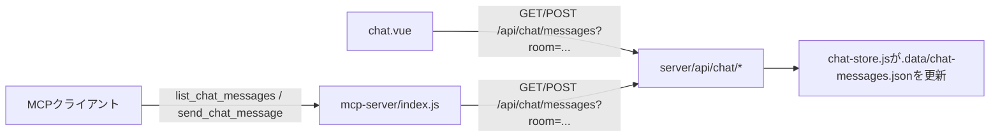

# Architecture

このリポジトリには2つのアプリケーションがある。

- `front/` — Nuxt 4 (Vue 3) 製のWebアプリ。ToDo管理画面（`/`）とチャットツール画面（`/chat`）を持つ。API通信・永続化はサーバー側（`server/`配下のNuxtサーバー）で行う。
- `mcp-server/` — `front/`のチャットAPIを読み書きするMCPサーバー（stdio）。独立したNode.jsプロジェクト。

## front/ のディレクトリ構成

```
front/
  nuxt.config.ts
  package.json
  app/
    app.vue              # レイアウト（ナビゲーション + <NuxtPage />）
    pages/
      index.vue          # ToDo画面
      chat.vue           # チャット画面
    components/
      TaskItem.vue       # タスク1件分の表示
    utils/
      tasks.js           # formatDue()
      chat.js            # formatTime()
    assets/
      css/
        main.css         # グローバルスタイル
  server/
    api/
      tasks/
        index.get.js       # タスク一覧取得
        index.post.js      # タスク追加
        [id].patch.js       # 完了状態の切替
        [id].delete.js      # タスク削除
        clear-done.post.js  # 完了済み一括削除
      chat/
        messages.get.js    # メッセージ一覧取得（チャンネル指定）
        messages.post.js   # メッセージ投稿（チャンネル指定）
        rooms.get.js        # チャンネル一覧取得
    utils/
      json-store.js       # front/.data/ 配下のJSONファイル読み書き
      task-store.js        # タスクのデータ層
      chat-store.js         # チャットメッセージのデータ層
    data/
      seed-tasks.json     # タスクの初期データ（シードデータ）定義
      chat-rooms.json      # チャンネル一覧（固定）の定義
      seed-chat-messages.json # チャットの初期データ（シードデータ）定義
```

## 各ファイルの役割

### クライアント側（`app/`）

- `app/app.vue` — 全ページ共通のナビゲーション（Tasks / Chat）と `<NuxtPage />` を配置する。
- `app/pages/index.vue` — `useFetch('/api/tasks')` でタスク一覧を取得し、フォーム入力（`title`/`due`）を保持する。追加・完了切替・削除・完了済み一括削除の操作は、それぞれ対応する`server/api/tasks/*`エンドポイントを`$fetch`で呼んだ後に`refresh()`でタスク一覧を再取得する。タスク状態を変更するのはここだけであり、`TaskItem`は表示専用で`toggle`/`delete`イベント経由で呼び出される。
- `app/pages/chat.vue` — `useFetch('/api/chat/rooms')`でチャンネル一覧を取得し、選択中のチャンネルID（`selectedRoomId`）を保持する。`useFetch('/api/chat/messages', { query: { room: selectedRoomId } })`は`selectedRoomId`の変更に応じて自動的に再取得される。投稿者名（`author`）と本文（`text`）も保持し、送信時に`server/api/chat/messages.post.js`を呼び、`refresh()`で一覧を再取得する。
- `app/components/TaskItem.vue` — タスク1件分の表示のみを行う。propsのみに依存する。
- `app/utils/tasks.js` / `app/utils/chat.js` — 表示用フォーマット関数（`due`の日付表示、メッセージ時刻表示）。Nuxtの自動importにより各ページ・コンポーネントから直接呼び出せる。

### サーバー側（`server/`）

- `server/api/tasks/*` — タスクのCRUD API。リクエストの検証を行い、`server/utils/task-store.js`を呼び出す。
- `server/api/chat/*` — チャットのチャンネル一覧・メッセージの取得・投稿API。`server/utils/chat-store.js`（`rooms.get.js`は`server/data/chat-rooms.json`を直接返す）を呼び出す。
- `server/utils/json-store.js` — `front/.data/`配下のJSONファイル（gitignore対象）を読み書きする共通ユーティリティ。ファイルが無ければ呼び出し側にフォールバック値を返す。
- `server/utils/task-store.js` — タスクのデータ層。`.data/tasks.json`が無ければ`server/data/seed-tasks.json`からシードデータを生成する。タスクの型は`{ id, title, due, done }`で、`due`はISO形式の日付文字列（`YYYY-MM-DD`）または空文字。
- `server/utils/chat-store.js` — チャットメッセージのデータ層。`.data/chat-messages.json`が無ければ`server/data/seed-chat-messages.json`からシードデータを生成する。メッセージの型は`{ id, room, author, text, createdAt }`。`getMessages(room)`は`room`（省略時は`"general"`）に一致するメッセージのみを返す。
- `server/data/seed-tasks.json` — タスクの初期データ（シードデータ）の定義。各要素は`{ title, offsetDays, done }`。ここを編集することでコードを変更せずに初期表示するタスクを変更できる。
- `server/data/chat-rooms.json` — チャンネル一覧（固定）の定義。各要素は`{ id, name, icon }`で、`app/pages/chat.vue`のサイドバーとヘッダーに表示される。ユーザーによる作成・編集はできない。
- `server/data/seed-chat-messages.json` — チャットの初期データ（シードデータ）の定義。各要素は`{ room, author, text, offsetMinutes }`。デモ向けに`general`・`dev`・`project-alpha`の3チャンネル分の会話が入っている。

永続化はいずれもNuxtサーバープロセス内のJSONファイル（`front/.data/`配下）で行われ、ブラウザの`localStorage`は使わない。そのため複数タブ・複数ブラウザから同じデータを参照できる。

## データフロー（ToDo）

1. ページ読み込み時、`index.vue`が`useFetch('/api/tasks')`でタスク一覧を取得する（サーバー側は`.data/tasks.json`が無ければシードデータで初期化する）。
2. ユーザー操作（追加・完了切替・削除・完了済み一括削除）は、対応する`server/api/tasks/*`エンドポイントへの`$fetch`呼び出しとなる。
3. サーバーは`task-store.js`経由で`.data/tasks.json`を更新する。
4. クライアントは`refresh()`でタスク一覧を再取得し、画面を更新する。

```mermaid
flowchart LR
    A[index.vue: ユーザー操作] --> B[server/api/tasks/* へ$fetch]
    B --> C[task-store.jsが.data/tasks.jsonを更新]
    B --> D[refresh\(\)でタスク一覧を再取得]
```

## データフロー（チャット・MCP連携）

チャットメッセージの読み書きは、Webブラウザからだけでなく`mcp-server/`のMCPサーバー経由でも行える。両者は同じ`server/api/chat/messages`エンドポイントを叩くため、どちらから投稿してもチャット画面・MCPクライアントの両方に反映される。メッセージはチャンネル（`room`）ごとに分かれており、`room`省略時は`"general"`チャンネルが対象になる。



- `mcp-server/index.js` — `@modelcontextprotocol/sdk`によるMCPサーバー（stdio）。`list_chat_messages`（メッセージ一覧取得）と`send_chat_message`（メッセージ投稿）の2ツールを提供し、いずれも任意の`room`引数（省略時は`"general"`）でチャンネルを指定できる。両ツールとも`front/`のHTTP API（既定値`http://localhost:3000`、`CHAT_API_BASE_URL`環境変数で変更可能）を呼び出し、チャットのデータストア（JSONファイル）に直接アクセスすることはない。
