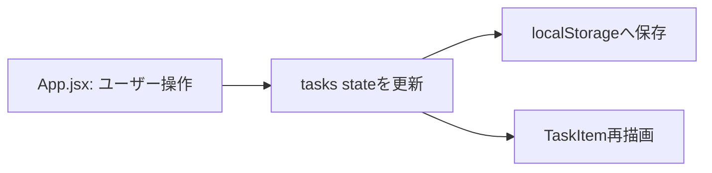

# Architecture

`front/` はルーティングなし・バックエンドなし・外部の状態管理ライブラリなしの、React 18 + Vite によるシングルページアプリ（タスク管理ツール）です。サーバーは存在せず、永続化はすべてクライアント側の `localStorage`（キーは `STORAGE_KEY` の値）で行われます。

## ディレクトリ構成

```
front/
  index.html
  package.json
  src/
    main.jsx            # エントリポイント
    App.jsx             # 状態とロジック
    style.css           # グローバルスタイル
    components/
      TaskItem.jsx       # タスク1件分の表示
    lib/
      tasks.js           # データ層
    data/
      seed-tasks.json     # 初期データ（シードデータ）定義
```

## 各ファイルの役割

- `src/App.jsx` — 状態（`tasks`、フォーム入力）と全ての変更ロジック（追加・完了切替・削除・完了済み一括削除）を `useState` で保持する。`useEffect` により `tasks` の変更のたびに `localStorage` へ保存する。タスク状態を変更するのはここだけであり、`TaskItem` は表示専用で `onToggle`/`onDelete` の props 経由で呼び出す。
- `src/lib/tasks.js` — データ層。`STORAGE_KEY`、`loadTasks()`（localStorageの読み込み・検証を行い、値が無い/不正な場合はシードデータにフォールバック）、`createSeedTasks()`、`formatDue()` を提供する。タスクの型は `{ id, title, due, done }` で、`due` はISO形式の日付文字列（`YYYY-MM-DD`）または空文字。`createSeedTasks()` は `src/data/seed-tasks.json` を読み込み、各エントリの `offsetDays`（今日からの相対日数）を `due` の日付文字列に変換して返す。
- `src/data/seed-tasks.json` — 初期データ（シードデータ）の定義ファイル。各要素は `{ title, offsetDays, done }`。ここを編集することでコードを変更せずに初期表示するタスクを変更できる。
- `src/components/TaskItem.jsx` — タスク1件分の表示のみを行う。propsのみに依存する。
- `src/main.jsx` — Reactのエントリポイント。`App` をルートにマウントする。
- `src/style.css` — `:root` のカスタムプロパティを使ったプレーンCSS。

## データフロー

1. 初回マウント時、`App.jsx` が `lib/tasks.js` の `loadTasks()` で `localStorage` からタスク一覧を読み込む（無い/不正な場合はシードデータ）。
2. ユーザー操作（追加・完了切替・削除・完了済み一括削除）は `App.jsx` 内のハンドラが `tasks` state を更新する。
3. `tasks` の変更を `useEffect` が検知し、`localStorage` に保存する。
4. `tasks` の再描画により `TaskItem` に props が渡り、一覧が更新される。


