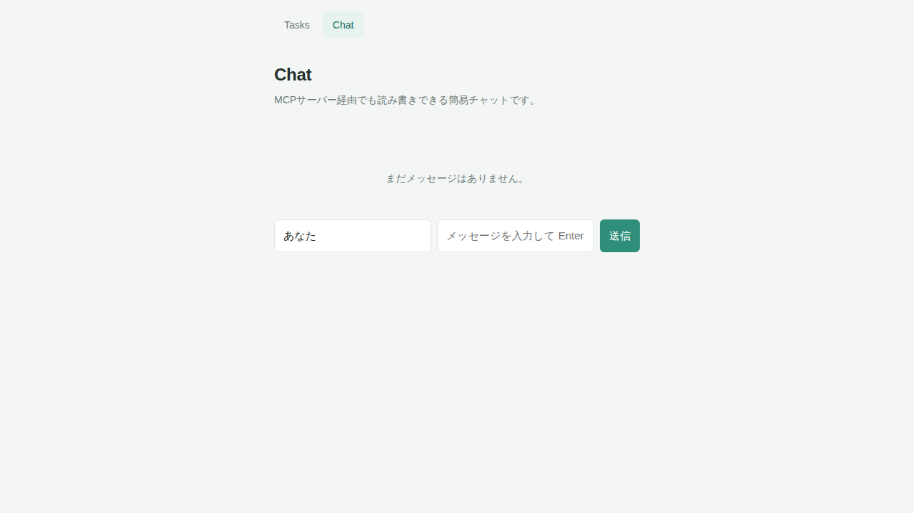

# チャット画面（Chat）

- ルート: `/chat`
- 実装: `front/app/pages/chat.vue`

## 画面



## 目的

簡易的なチャットツール。メッセージの一覧表示と投稿ができる。Webブラウザからだけでなく、`mcp-server/`のMCPサーバー経由でも同じメッセージを読み書きできる（詳細は`docs/Architecture.md`の「データフロー（チャット・MCP連携）」を参照）。

## UI要素

| 要素 | 説明 |
|---|---|
| メッセージ一覧 | 投稿順（古い順）に、投稿者名・投稿時刻・本文を表示する |
| 空状態メッセージ | メッセージが0件のとき「まだメッセージはありません。」を表示する |
| 名前入力欄 | 投稿者として表示する名前。初期値は「あなた」 |
| メッセージ入力欄 | 本文の入力。空欄（前後の空白のみを含む場合も）は送信しない |
| 送信ボタン | フォーム送信でメッセージを投稿する |

## 操作とAPI呼び出し

| 操作 | 呼び出すAPI |
|---|---|
| 画面表示 | `GET /api/chat/messages` |
| メッセージ送信 | `POST /api/chat/messages` |

送信後は`refresh()`でメッセージ一覧を再取得して画面に反映する（詳細は`docs/api/openapi.json`を参照）。

## データの型

```
ChatMessage = { id: string, author: string, text: string, createdAt: string (ISO 8601日時) }
```

## 初期表示

サーバー側に保存済みのメッセージが無い場合、メッセージ一覧は空（0件）から始まる。シードデータは無い。
