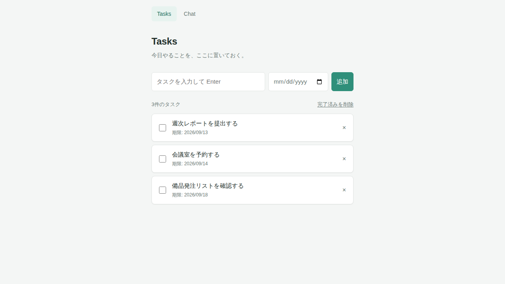

# ToDo画面（Tasks）

- ルート: `/`
- 実装: `front/app/pages/index.vue`

## 画面



## 目的

今日やるべきタスクを一覧管理する。追加・完了切替・削除・完了済みの一括削除ができる。

## UI要素

| 要素 | 説明 |
|---|---|
| タイトル入力欄 | タスク名を入力するテキスト入力。空欄のまま送信しても何も起きない（前後の空白はトリムされる） |
| 期限入力欄 | 日付入力（`<input type="date">`）。省略可 |
| 追加ボタン | フォーム送信でタスクを追加する |
| 件数表示 | 「N件のタスク」で現在のタスク総数（完了済み含む）を表示する |
| 完了済みを削除リンク | 完了済み（`done: true`）のタスクを一括削除する |
| タスク一覧 | `TaskItem`コンポーネントの縦並び。チェックボックス・タイトル・期限（あれば）・削除ボタンを持つ |
| 空状態メッセージ | タスクが0件のとき「タスクはまだありません。上の入力欄から追加してください。」を表示する |

## 操作とAPI呼び出し

| 操作 | 呼び出すAPI |
|---|---|
| 画面表示 | `GET /api/tasks` |
| タスク追加 | `POST /api/tasks` |
| 完了状態の切替（チェックボックス） | `PATCH /api/tasks/{id}` |
| タスク削除（×ボタン） | `DELETE /api/tasks/{id}` |
| 完了済みを削除 | `POST /api/tasks/clear-done` |

いずれの操作も、APIを呼んだ後に`refresh()`でタスク一覧を再取得して画面に反映する（詳細は`docs/api/openapi.yaml`を参照）。

## データの型

```
Task = { id: string, title: string, due: string (YYYY-MM-DD または空文字), done: boolean }
```

## 初期表示（シードデータ）

サーバー側に保存済みのタスクが無い場合、`front/server/data/seed-tasks.json`から生成した3件のタスクが初期表示される。
